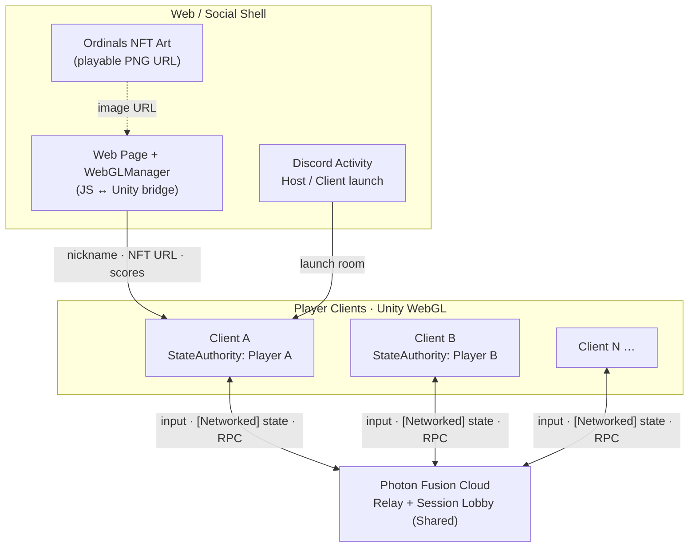
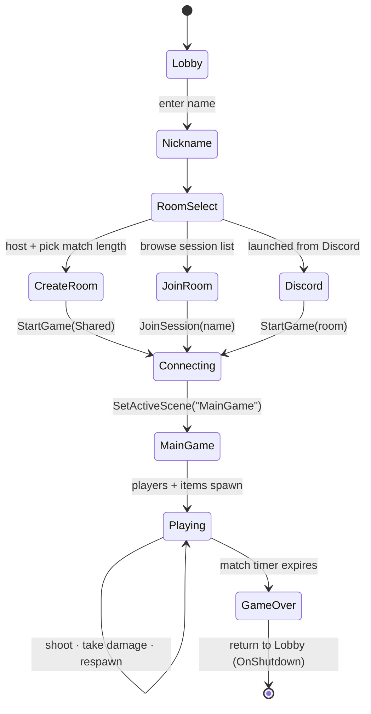
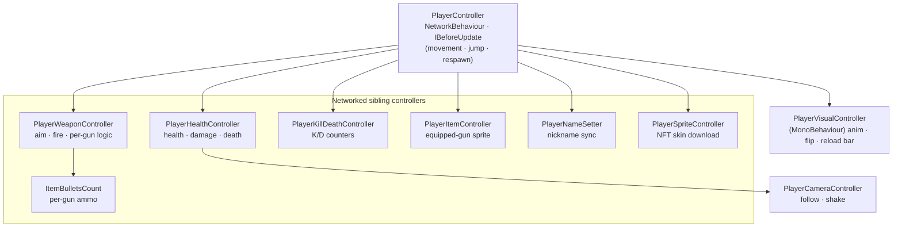
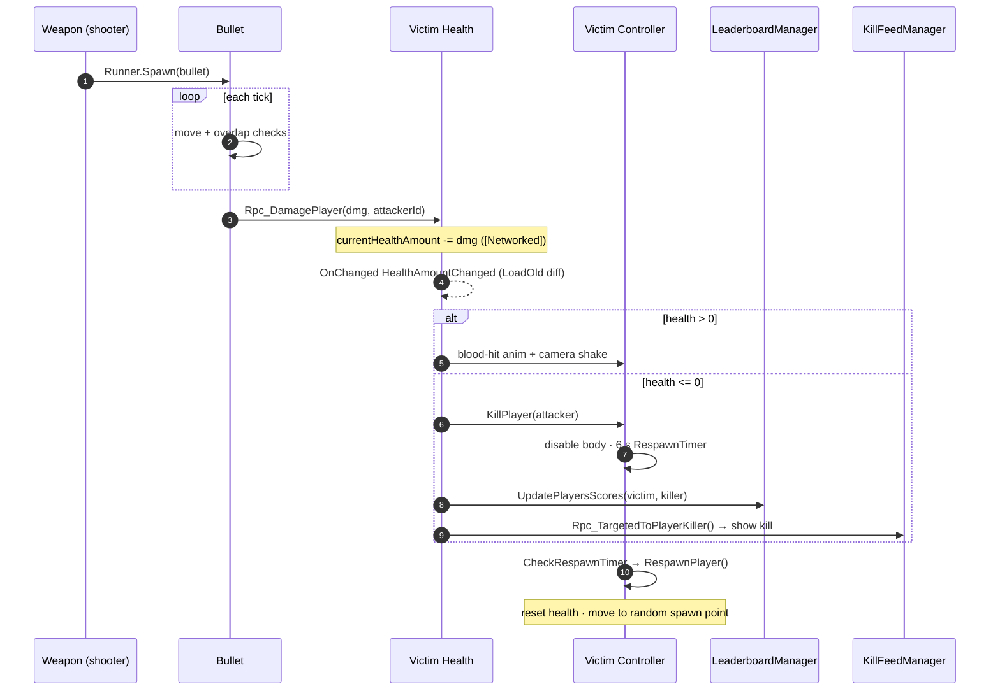
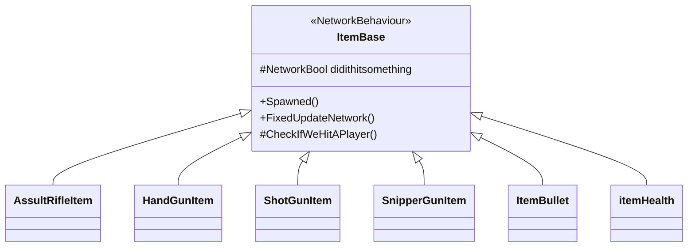
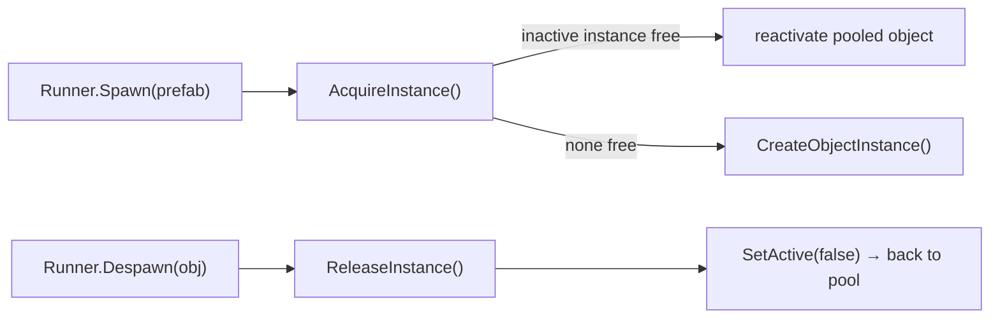

# Multiplayer-game — OrdinalsPlay


A real-time **multiplayer 2D arena shooter** built in **Unity** with **Photon Fusion** networking. Up to **12 players** drop into a shared match, grab weapons and power-ups, and fight on a kill/death leaderboard until the match timer runs out.

Its defining twist: the game ships as a **WebGL** experience where each player's character is skinned with their own **Ordinals (Bitcoin NFT) artwork**, streamed in at runtime, and matches can be launched straight from a **Discord** activity.

https://github.com/user-attachments/assets/ffc15076-c8a5-4d93-bf72-0b8363c29f16

> **About this repository.** This repo is a **source-code snapshot** of the game's C# scripts (`.cs` + Unity `.meta` files). It is intended to showcase the game's *architecture* — the Unity scenes, prefabs, sprites, the Photon Fusion package, and the external WebGL/JS bridge live in the full project and are **not** included here. See [Building & Running](#building--running) for what a full build requires.

---

## Table of Contents

- [Gameplay Features](#gameplay-features)
- [Technology Stack](#technology-stack)
- [High-Level Architecture](#high-level-architecture)
- [Architectural Pillars](#architectural-pillars)
- [Application Flow: Lobby → Match](#application-flow-lobby--match)
- [Networking Model — Photon Fusion Shared Mode](#networking-model--photon-fusion-shared-mode)
- [Player Architecture](#player-architecture)
- [Combat System](#combat-system)
- [Item & Pickup System](#item--pickup-system)
- [Networked Object Pooling](#networked-object-pooling)
- [Managers & UI](#managers--ui)
- [Web3 / WebGL Integration](#web3--webgl-integration)
- [Project Structure](#project-structure)
- [Building & Running](#building--running)
- [Observations & Hardening Opportunities](#observations--hardening-opportunities)
- [Credits & Links](#credits--links)

---

## Gameplay Features

- **Up to 12-player** real-time deathmatch over Photon Fusion.
- **Four weapons**, each with distinct feel: Assault Rifle, Handgun, Shotgun (10-pellet spread), and Sniper (dedicated high-damage projectile).
- **Pickups** that spawn and respawn around the map: weapon crates, ammo refills, and health packs.
- **Kill/death leaderboard** and a **kill feed**, synced across all clients.
- **Death & respawn loop** with a timed respawn, blood-hit feedback, and camera shake.
- **Double jump**, mouse-aimed shooting, and directional sprite flipping.
- **NFT-skinned avatars** — a player's character sprite is downloaded from their Ordinals image URL at runtime.
- **Discord-launchable** rooms (host / client entry points) alongside a full in-game room browser.
- **Configurable match length** (5 / 10 / 15 minutes) chosen at room creation.

---

## Technology Stack

| Concern | Technology | Notes |
|---------|-----------|-------|
| Engine | **Unity** (C#) | 2D physics, Animator, TextMeshPro UI |
| Networking | **Photon Fusion 1.x** | `NetworkBehaviour`, `[Networked]`, `Changed<T>` / `OnChanged`, `TickTimer`, RPCs |
| Topology | **Fusion Shared Mode** | No dedicated server; per-object `StateAuthority` |
| Deployment | **WebGL** | Browser build; JS ↔ Unity interop via `WebGLManager` |
| Asset loading | **UnityWebRequest** | Streams NFT PNG skins at runtime |
| Launch surface | **Discord activity** | Host / client entry panels |
| Web3 | **Ordinals (Bitcoin NFT)** | Player identity / avatar art |

---

## High-Level Architecture

The game is a single Unity client that connects, peer-to-peer via the Photon relay, to other clients running the same simulation. There is **no authoritative game server** — Fusion's Shared Mode distributes authority per networked object, and a web shell wraps the WebGL build to inject NFT identity and report scores.



Inside each client, a single **service-locator singleton** (`GlobalManagers`) wires together the networking, spawning, pooling, audio, leaderboard, and UI managers, and is preserved across scene loads via a `DontDestroyOnLoad` (`DDOL`) object.

---

## Architectural Pillars

The codebase is organized around a handful of deliberate patterns. Each is expanded in its own section below.

| # | Pillar | Where it lives | What it does |
|---|--------|----------------|--------------|
| 1 | **Fusion Shared-Mode authority** | every `NetworkBehaviour` | Each client owns (`StateAuthority`) its own player; state replicates via `[Networked]` + `OnChanged`. |
| 2 | **Service Locator** | `GlobalManagers` + `DDOL` | One registry for all managers, alive across scenes. |
| 3 | **Component-based player** | `PlayerController` + siblings | The player is a composition of focused controllers, not one god-class. |
| 4 | **Input command pipeline** | `LocalInputPoller` → `PlayerData` | Local input is captured into a network-input struct and consumed inside the simulation tick. |
| 5 | **Template Method** | `ItemBase`, `Bullet` | Base classes define the networked lifecycle; subclasses override the effect hook. |
| 6 | **Networked object pool** | `ObjectPoolingManager` | Implements Fusion's `INetworkObjectPool` to recycle bullets/items. |
| 7 | **Panel state machine** | `LobbyUIManager` + `LobbyPanelBase` | Typed lobby panels shown/hidden with pop animations. |
| 8 | **Data-driven audio** | `AudioController` + `Utils` | An `SfxType → clip` table played through one entry point. |

---

## Application Flow: Lobby → Match

The player journey spans two Unity scenes — **Lobby** and **MainGame** — bridged by `NetworkRunnerController`, which owns the Fusion connection and triggers the scene swap once a session is live.



Connection specifics from `NetworkRunnerController`: it instantiates a `NetworkRunner` prefab, enables `ProvideInput`, joins the **Shared** session lobby, and starts a session with `GameMode.Shared`, a **12-player** cap, and the `ObjectPoolingManager` plugged in as Fusion's object pool. On shutdown it returns everyone to the Lobby scene, and it live-rebuilds the room-browser UI from Fusion's `OnSessionListUpdated` callback.

---

## Networking Model — Photon Fusion Shared Mode

### Authority

In Shared Mode there is no host-owns-everything server. Instead, **each client holds `StateAuthority` over its own player object** and the networked components attached to it. Code paths that mutate authoritative state are consistently guarded with `Object.HasStateAuthority`, and cross-client effects (damage, kill notifications, score updates) are delivered through **RPCs** with explicit `RpcSources` / `RpcTargets` (including `[RpcTarget]` for point-to-point messages like the kill feed).

### Input pipeline

Input is modeled as a Fusion **command struct** (`PlayerData : INetworkInput`) carrying horizontal movement, the mouse position, and a `NetworkButtons` bitfield. A dedicated poller injects it, and the simulation reads it back on every peer:

```mermaid
sequenceDiagram
    autonumber
    participant KB as Keyboard/Mouse
    participant PC as PlayerController
    participant LIP as LocalInputPoller
    participant F as Fusion Runner
    participant SIM as Simulation

    KB->>PC: raw axis/keys (BeforeUpdate)
    F->>LIP: OnInput(input)
    LIP->>PC: GetPlayerNetworkInput()
    PC-->>LIP: PlayerData struct
    LIP->>F: input.Set(PlayerData)
    Note over F: input replicated for this tick
    F->>SIM: FixedUpdateNetwork()
    SIM->>SIM: TryGetInputForPlayer&lt;PlayerData&gt;()
    SIM->>SIM: move · jump · aim · shoot
    Note over SIM: [Networked] writes → OnChanged on remote peers
```

### State replication & change detection

Networked fields are declared with `[Networked]`, and reactive UI/VFX updates hang off Fusion's `OnChanged` callbacks — many of which call `changed.LoadOld()` to diff the **previous vs. current** value (e.g. only flashing a blood-hit when health actually dropped). The project exercises a broad slice of Fusion's networked primitives:

| Type | Example field(s) | Purpose |
|------|------------------|---------|
| `TickTimer` | `RespawnTimer`, `matchTimer`, `shootCoolDown`, `lifeTimeTimer` | Server-consistent countdowns |
| `NetworkBool` | `PlayerIsAlive`, `didithitsomething`, `playerMuzzleEffect` | Replicated flags |
| `NetworkString<_N>` | `playerName`, `NickName`, `imageLink` (`_512`) | Names + NFT image URL |
| `NetworkButtons` | `buttonPrev` | Edge-detected button presses |
| `NetworkLinkedList<int>` | `currentPlayerInLeaderBoard` (`Capacity(16)`) | Synced scoreboard roster |
| `Quaternion` / enum | `currentPlayerPivotRotation`, `PlayerControllerGunType` | Aim rotation, equipped gun |

---

## Player Architecture

Rather than a single monolithic player script, `PlayerController` acts as a **composition root**: on `Spawned()` it caches a set of sibling `NetworkBehaviour`s (via `GetComponent`) and delegates each concern to a focused controller. Movement, jump, and the respawn timer live in the controller itself; everything else is composed in.



A key separation of concerns: **networked state** (health, ammo, equipped gun, nickname, skin) lives in `NetworkBehaviour`s, while **pure presentation** (walk/shoot/die animations, sprite flipping, the reload slider) lives in the non-networked `PlayerVisualController`, driven from `PlayerController.Render()`.

---

## Combat System

`PlayerWeaponController` translates the networked aim vector into a pivot rotation, then dispatches firing through a per-gun-type switch (`PickWaysToSpawnBullets`). Each shot spawns a **networked bullet** through the object pool, decrements ammo, plays a muzzle effect (state synced via `OnChanged`), and updates the ammo HUD via RPC. Empty magazines trigger a throttled "empty gun" sound.

| Weapon | Fire rate | Magazine | Projectile | Signature behavior |
|--------|-----------|----------|------------|--------------------|
| **Assault Rifle** | 0.2 s | 30 | `bulletPrefab` | Sustained fire |
| **Handgun** | 0.2 s | 12 | `bulletPrefab` | Default / issued on respawn |
| **Shotgun** | 2.5 s | 8 | `bulletPrefab` × 10 | 10 pellets across a 35° spread |
| **Sniper** | 1.0 s | 6 | `snipperBulletPrefab` | Dedicated high-damage round + reload SFX |

The damage → death → respawn cycle is fully networked and authority-checked at each hop:



Bullets self-manage a `TickTimer` lifetime, despawn on ground/player contact, and never damage their own shooter (`player.PlayerId != Object.StateAuthority.PlayerId`). The code also scaffolds Fusion **lag compensation** (`LagCompensatedHit`, `Runner.LagCompensation`) for a future move away from direct physics overlaps.

---

## Item & Pickup System

Pickups are a clean **Template Method** hierarchy. `ItemBase` (a `NetworkBehaviour`) owns the shared lifecycle — detect a player overlap in `FixedUpdateNetwork`, mark itself consumed via the networked `didithitsomething` flag, play a pickup sound, and despawn — while each subclass overrides a single hook, `CheckIfWeHitAPlayer()`, to apply its own effect.



| Pickup | Class | Effect on the player who touches it |
|--------|-------|-------------------------------------|
| Weapon crates | `AssultRifleItem`, `HandGunItem`, `ShotGunItem`, `SnipperGunItem` | Equip that gun (sprite + `ItemBulletsCount` + synced gun state) |
| Ammo | `ItemBullet` | Refill the current gun to its full magazine |
| Health | `itemHealth` | Heal +50 HP, capped at 100 |

`ItemSpawnController` (a networked singleton) seeds pickups at fixed spawn points, and — **authority-gated to the first active player** — watches each point with a physics overlap and respawns a fresh item on a `TickTimer` after one is consumed. Per-gun magazine sizes (Rifle 30 / Handgun 12 / Shotgun 8 / Sniper 6) are centralized in `ItemBulletsCount`.

---

## Networked Object Pooling

Because a fast shooter spawns and destroys bullets and pickups constantly, `ObjectPoolingManager` implements Fusion's **`INetworkObjectPool`** and is registered on the runner at session start. Instead of instantiating and destroying `NetworkObject`s, Fusion asks the pool to **acquire** (reuse an inactive instance, or create one if none is free) and **release** (deactivate rather than destroy) — keeping a `Dictionary<prefab, List<instances>>` of reusable objects and cutting GC churn during combat.



---

## Managers & UI

A single `GlobalManagers` singleton is the **service locator** every system registers itself into on `Awake`/`Start`, so gameplay code reaches shared services through one well-known entry point instead of scattered singletons.

| Manager | Base type | Responsibility |
|---------|-----------|----------------|
| `GlobalManagers` | `MonoBehaviour` (singleton) | Central registry for all managers |
| `NetworkRunnerController` | `MonoBehaviour`, `INetworkRunnerCallbacks` | Fusion connection, sessions, room list, scene load |
| `PlayerSpawnerController` | `NetworkBehaviour`, `IPlayerJoined/Left` | Spawn / despawn players; kick off item spawning |
| `ObjectPoolingManager` | `MonoBehaviour`, `INetworkObjectPool` | Recycle networked bullets & items |
| `GameManager` | `NetworkBehaviour` | Networked match timer + game-over broadcast |
| `ItemSpawnController` | `NetworkBehaviour` (singleton) | Spawn / respawn pickups |
| `LeaderboardManager` | `NetworkBehaviour` | Synced scoreboard via `NetworkLinkedList` |
| `KillFeedManager` | `MonoBehaviour` | Kill-feed UI entries |
| `AudioController` | `MonoBehaviour` | Data-driven SFX (`SfxType → clip`) |
| `AudioManager` | `MonoBehaviour` (singleton) | Button-click SFX |
| `WebGLManager` | *(external)* | JS ↔ Unity bridge for NFT URLs & score reporting |

**Lobby UI** is a small state machine: `LobbyUIManager` holds an array of `LobbyPanelBase` panels and shows exactly one by `LobbyPanelType` (Nickname, MiddleSection, JoinRoom, DiscordHost, DiscordClient, Lobby, Tutorial), each animating in/out via a shared pop-in/pop-out clip. Concrete panels (e.g. `MiddleSectionPanel`, `DiscordHost`, `DiscordClient`) extend the base and route their button clicks into `NetworkRunnerController`.

---

## Web3 / WebGL Integration

The Web3 layer lives at the boundary between the web page and the Unity WebGL build, mediated by the external `WebGLManager`:

1. The hosting page hands Unity the player's **Ordinals collection + token id**, which `PlayerController` composes into an image URL (`…/assets/collections/{collection}/playable/{id}.png`).
2. That URL is replicated as a `NetworkString<_512>`, and `PlayerSpriteController` downloads it with `UnityWebRequestTexture`, builds a `Sprite`, and applies it as the character skin — so **every client sees every player's NFT art**.
3. On the authoritative side, score lifecycle hooks (`initiateScoreUpdate` / `finishScoreUpdate`) are invoked back through `WebGLManager` for the web/backend layer.

---

## Project Structure

```
Multiplayer-game/
├── Lobby/                          # Pre-match UI (panel system + Discord entry)
│   ├── LobbyUIManager.cs               # Shows one panel at a time
│   ├── LobbyPanelBase.cs               # Base panel (typed, pop in/out)
│   ├── CreateNickNamePanel.cs          # Nickname entry
│   ├── MiddleSectionPanel.cs           # Create room + match length
│   ├── JoinRoomPanel.cs                # Join by name
│   ├── DiscordHost.cs / DiscordClient.cs   # Discord activity entry points
│   ├── LobbyPanel.cs / TutorailPanel.cs
│   ├── SessionEntryPrefab.cs           # A row in the room browser
│   ├── LoadingCavasController.cs       # Connection loading overlay
│   └── RefreshButton.cs / DropdownScript.cs
├── LobbyMultipleRoom/              # Room-browser list UI
│   ├── SessionListUIHandler.cs
│   └── SessionInfoListUI.cs
├── MainGame/                       # In-match gameplay
│   ├── GameManager.cs                  # Networked match timer + game over
│   ├── PlayerController.cs             # Networked player (composition root)
│   ├── PlayerData.cs                   # INetworkInput command struct
│   ├── LocalInputPoller.cs             # Local input → Fusion
│   ├── PlayerWeaponController.cs       # Aim, fire, per-gun logic
│   ├── PlayerHealthController.cs       # Health, damage, death
│   ├── PlayerKillDeathController.cs    # K/D counters
│   ├── PlayerItemController.cs         # Equipped-gun visuals
│   ├── PlayerSpriteController.cs       # NFT skin download
│   ├── PlayerNameSetter.cs             # Nickname sync
│   ├── PlayerVisualController.cs       # Animation + flip (non-networked)
│   ├── PlayerCameraController.cs       # Camera follow + shake
│   ├── PlayerSpawnerController.cs      # Spawn / despawn players
│   ├── PlayerGrapple.cs                # Grapple / rope input
│   ├── ObjectPoolingManager.cs         # Fusion INetworkObjectPool
│   ├── MovingBackGround.cs             # Parallax background
│   ├── Bullet/                         # Networked projectiles
│   │   ├── Bullet.cs
│   │   └── SnipperBullet.cs
│   ├── Items/                          # Pickup system (Template Method)
│   │   ├── ItemBase.cs · GunType.cs · ItemBulletsCount.cs
│   │   ├── ItemSpawnController.cs
│   │   ├── Guns/  (Assult / HandGun / ShotGun / SnipperGun items)
│   │   └── ItemS/ (ItemBullet, itemHealth)
│   ├── Features/LeaderBoard/           # Synced scoreboard
│   │   ├── LeaderboardManager.cs · LeaderboardUI.cs
│   │   └── PlayerLeaderBoardItem.cs · PlayerLeaderboardDataMono.cs
│   ├── KillPopUpUI/                    # Kill feed
│   │   ├── KillFeedManager.cs
│   │   └── KilledPlayerItem.cs
│   ├── CrossHair/MouseCursor.cs        # Custom cursor
│   ├── LocalUI/PlayerLocalUIManager.cs
│   ├── MainGameUI/MainGameUIManager.cs
│   └── GameOverPanel.cs / RespawnPanel.cs
├── Others/                         # Cross-cutting infrastructure
│   ├── GlobalManagers.cs               # Service-locator singleton
│   ├── NetworkRunnerController.cs      # Fusion connection core
│   ├── DDOL.cs                         # DontDestroyOnLoad
│   └── Utils.cs                        # Shared helpers + SFX enum
└── Sounds/
    └── AudioController.cs              # Data-driven SFX player
```

---

## Building & Running

> This repository contains **scripts only**. It is not a runnable Unity project on its own.

To assemble a playable build you would need to combine these scripts with the full project's assets:

1. **Unity** — open/create a project with a compatible Unity LTS version and place these scripts under `Assets/`.
2. **Photon Fusion (v1.x)** — import the Fusion SDK and set your **Photon App ID** in the Fusion Hub. The netcode here uses the Fusion 1 API (`Changed<T>` + `OnChanged`), not Fusion 2.
3. **Scenes** — provide the `Lobby` and `MainGame` scenes and add both to Build Settings (the runner loads them by name).
4. **Prefabs & art** — supply the networked player prefab, bullet prefabs, item prefabs, spawn points, UI panels, animations, and audio clips the scripts reference via `[SerializeField]`.
5. **WebGL bridge** — implement/import the `WebGLManager` (the JS ↔ Unity interop that feeds NFT image URLs in and reports scores out) for WebGL builds.
6. **Build to WebGL** and host behind the web/Discord shell.

---

## Observations & Hardening Opportunities

Documented candidly, both as a guide for readers and as a natural backlog:

- **Scripts-only snapshot.** Scenes, prefabs, sprites, the Fusion package, and `WebGLManager` are external, so the repo documents architecture rather than building as-is.
- **Lag compensation is scaffolded but inactive.** Hit detection currently uses direct 2D physics overlaps; the `LagCompensatedHit` / `Runner.LagCompensation` path is present (commented) for a more authoritative, latency-aware upgrade.
- **Dead/commented code paths.** Several exploratory alternatives (input-authority variants, older spawn logic) remain commented out and could be pruned for clarity.
- **Placeholder change-handlers.** A few `OnChanged` callbacks (e.g. kill/death counters) are wired but have empty visual-update bodies.
- **Duplicated scoring state.** K/D is tracked both in `PlayerKillDeathController` and in `PlayerLeaderboardDataMono`; consolidating to one source of truth would reduce drift.
- **Identifier typos.** Cosmetic naming issues (`AssultRifleItem`, `SnipperGun`, `didithitsomething`, `SeverNectSpawnPoint`, `RendererVisuals`, `LoadingCavasController`) are worth a rename pass for readability.
- **Magic numbers.** Fire rates, respawn delay (6 s), and heal amount (+50) are inline; extracting them into tunable ScriptableObjects would ease balancing.

---

## Credits & Links

- Project: **OrdinalsPlay** — a WebGL multiplayer shooter with Ordinals NFT avatars.
- Announcement / demo: https://twitter.com/OrdinalsPlay/status/1708301012983775702
- No open-source license is currently declared in the repository; add one if you intend others to reuse the code.

---

*A Unity + Photon Fusion case study in real-time multiplayer architecture: shared-mode authority, component-based players, networked pooling, and a Web3-skinned WebGL front end.*
